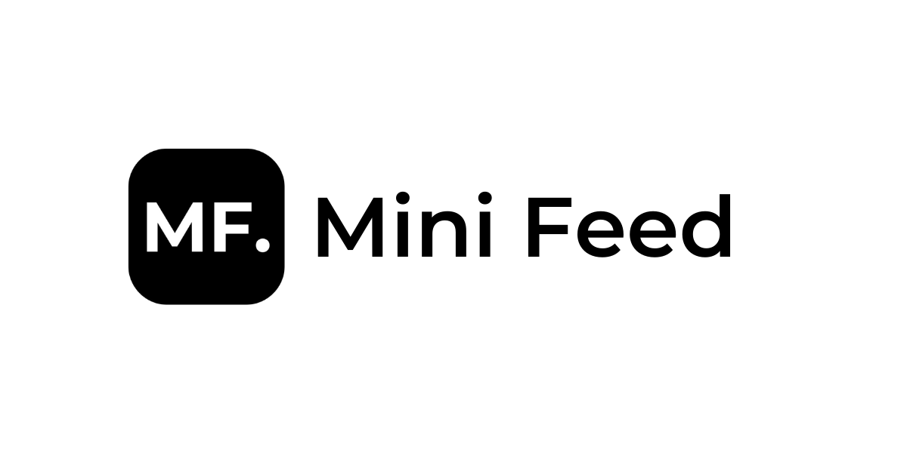

# Mini Feed

The one-stop shop for content you love.

## Demo

Here's a quick demo of the app.

[Mini Feed - The one stop shop for content you love](https://www.youtube.com/watch?v=cYvI8qKOfLc)

## Run Locally

Clone the project

```bash
  git clone https://github.com/zaidmukaddam/mini-feed.git
```

Go to the project directory

```bash
  cd mini-feed
```

Install dependencies

```bash
  npm install
```

Create an .env file in root and add your variables

```
  AUTH0_SECRET=
  AUTH0_BASE_URL=
  AUTH0_ISSUER_BASE_URL=
  AUTH0_CLIENT_ID=
  AUTH0_CLIENT_SECRET=
  MONGODB_URI=
  TWITTER_BEARER_TOKEN=
```

Start the app

```bash
  npm run dev
```

## Tech Stack

- **NextJS**

- **MongoDB**

- **Auth0**

- **Framer Motion**

- **Vercel**

## Author

[Zaid Mukaddam](https://www.github.com/zaidmukaddam)

## License

[MIT](LICENSE)
